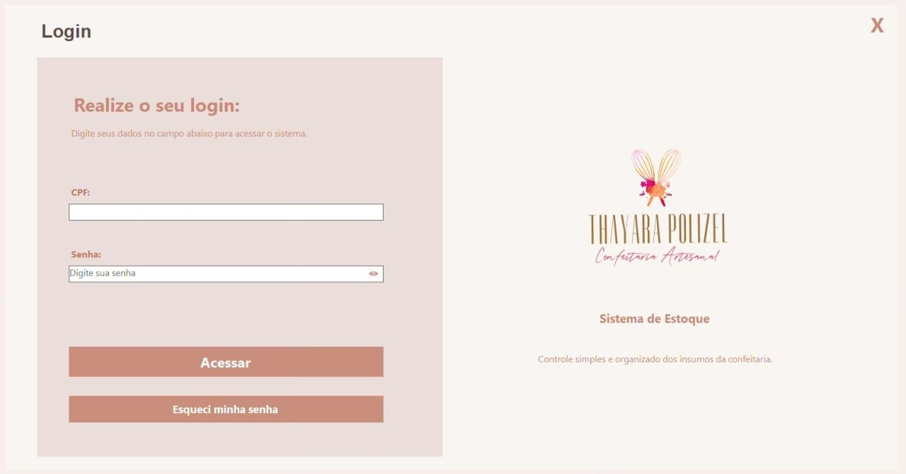
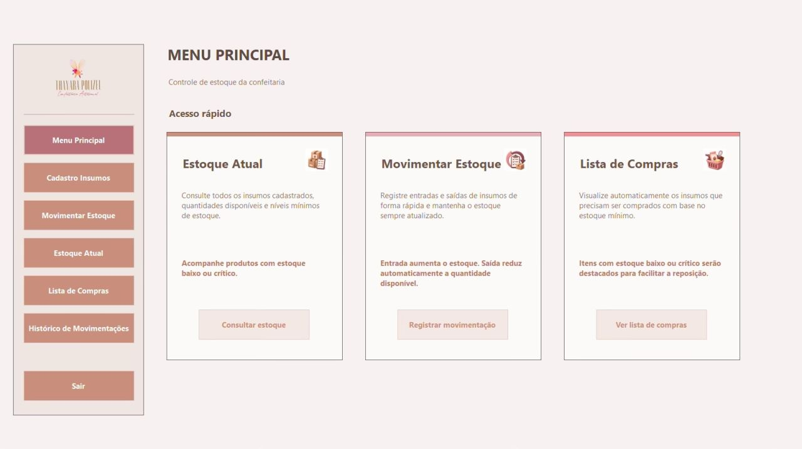
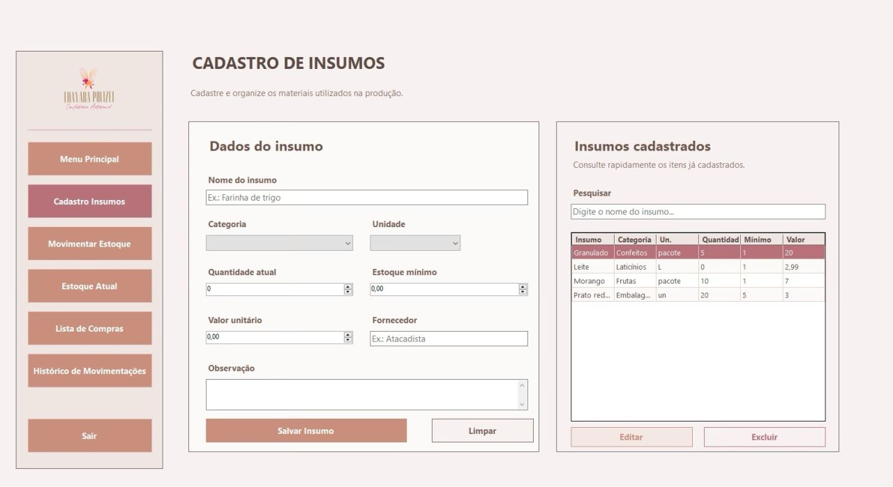
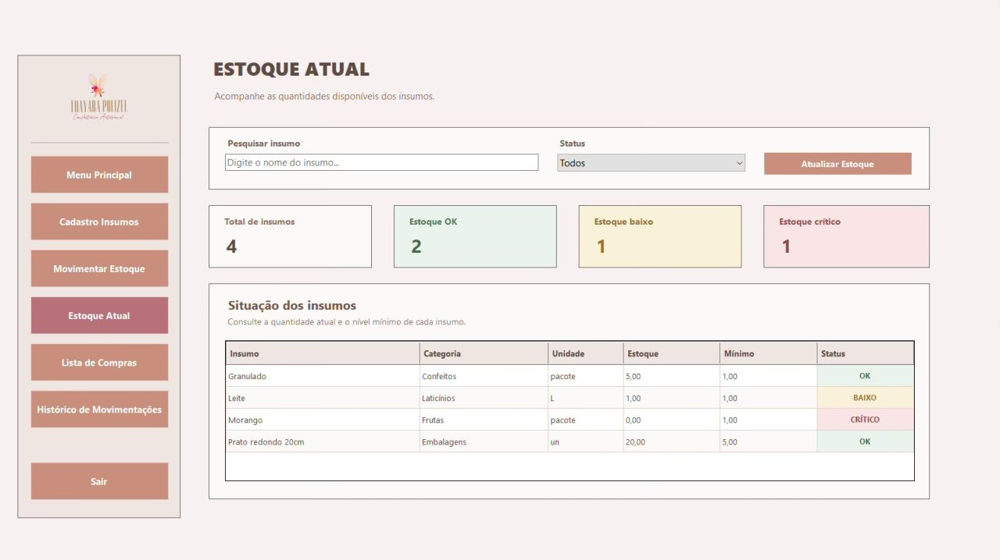
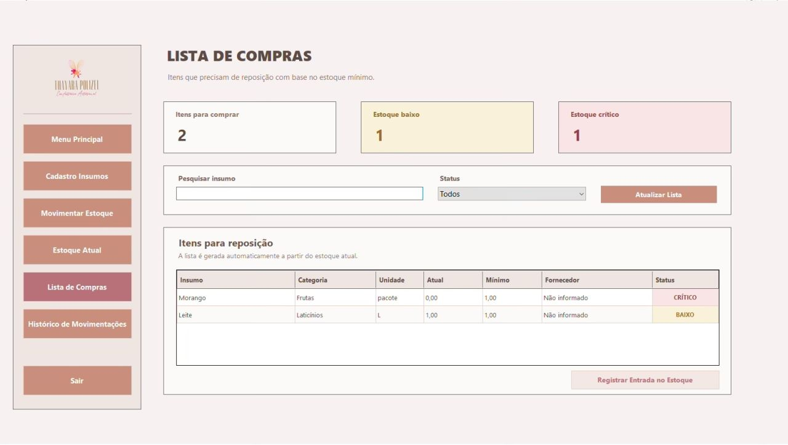
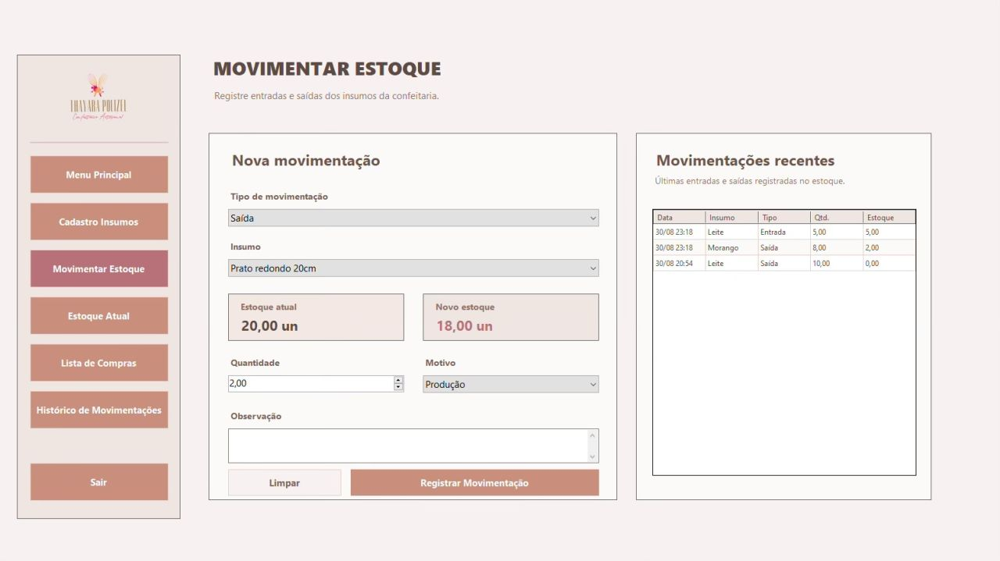
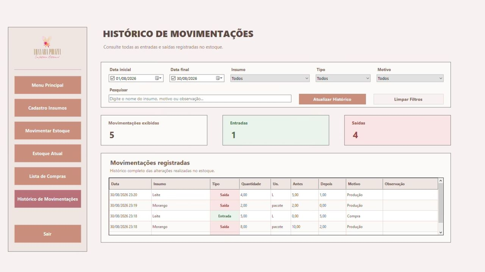
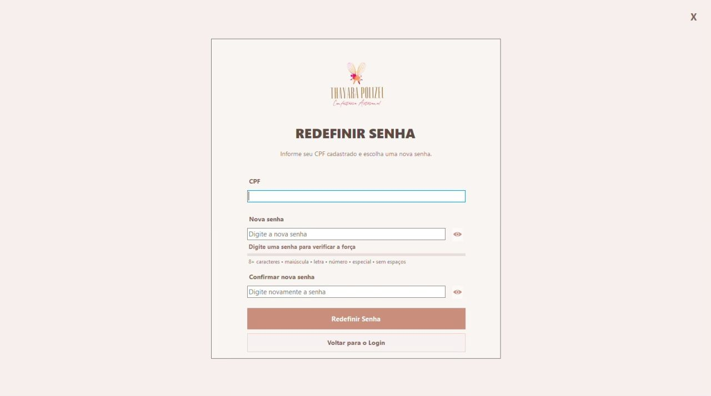
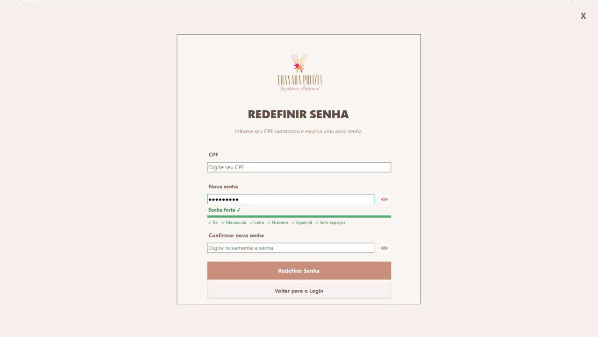

# 🍰 SistemaEstoqueConfeitaria

Sistema desktop de controle de estoque desenvolvido para auxiliar no gerenciamento de insumos de uma confeitaria.

O projeto foi desenvolvido em **C#**, utilizando **Windows Forms** para a interface e **SQLite** para armazenamento dos dados.

---

## 📌 Sobre o projeto

O **SistemaEstoqueConfeitaria** foi desenvolvido com o objetivo de facilitar o controle dos insumos utilizados em uma confeitaria, permitindo consultar o estoque e registrar suas movimentações de forma organizada.

O sistema possui uma interface desktop desenvolvida em Windows Forms e utiliza **SQLite** para armazenamento dos dados.

---

## 🚀 Funcionalidades

- 🔐 Sistema de login
- 📦 Cadastro de insumos
- 📊 Consulta do estoque
- 🔄 Movimentação de estoque
- 📋 Lista de estoque
- 📜 Histórico de movimentações
- 🔑 Redefinição de senha
- ⏳ Tela de carregamento
- 💾 Integração com banco de dados SQLite

---

## 🖥️ Telas do sistema

### 🔐 Login

Tela de acesso ao sistema.



---

### 🏠 Menu principal

Menu principal para acesso às funcionalidades do sistema.



---

### 📦 Cadastro de insumos

Tela destinada ao cadastro dos insumos utilizados pela confeitaria.



---

### 📊 Estoque

Visualização dos itens cadastrados e das informações relacionadas ao estoque.



---

### 📋 Lista de estoque

Listagem dos itens disponíveis no estoque.



---

### 🔄 Movimentação de estoque

Tela para registro das movimentações realizadas no estoque.



---

### 📜 Histórico

Consulta do histórico das movimentações realizadas.



---

### 🔑 Redefinição de senha

Fluxo de redefinição de senha do sistema.





---

### ⏳ Carregamento

Tela de carregamento apresentada durante a inicialização do sistema.


---

## 🛠️ Tecnologias utilizadas

- **C#**
- **Windows Forms**
- **SQLite**
- **Visual Studio**

---

## 🗂️ Estrutura do projeto

```text
SistemaEstoqueConfeitaria/
├── Screenshots/
│   ├── frmcadastroinsumos.jpg
│   ├── frmestoque.jpg
│   ├── frmhistorico.jpg
│   ├── frmlistaestoque.jpg
│   ├── frmloading.jpg
│   ├── frmlogin.jpg
│   ├── frmmenu.jpg
│   ├── frmmovimentarestoque.jpg
│   ├── frmredefinirsenha1.jpg
│   └── frmredefinirsenha2.jpg
│
├── SistemaEstoqueConfeitaria/
├── .gitignore
└── SistemaEstoqueConfeitaria.sln
```

---

## 🎯 Objetivo

Desenvolver uma solução desktop para auxiliar no gerenciamento de estoque de uma confeitaria, proporcionando maior organização no controle dos insumos e no acompanhamento das movimentações realizadas.

---

## 📌 Status do projeto

🚧 Projeto em desenvolvimento e evolução contínua.

---

## 👨‍💻 Equipe

**Rubens Machado da Costa**  
**Natalia Matias**

Projeto desenvolvido em conjunto, com foco na criação de uma solução para controle e gerenciamento de estoque.

---

⭐ Se este projeto foi útil ou interessante para você, considere deixar uma estrela no repositório.

⭐ Se este projeto foi útil ou interessante para você, considere deixar uma estrela no repositório.

---

⭐ Se este projeto foi útil ou interessante para você, considere deixar uma estrela no repositório.
